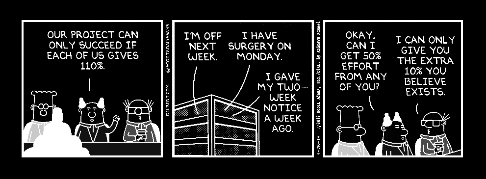

# MMM-DailyDilbert
A module for MagicMirror<sup>2</sup> that displays the daily Dilbert strip.

</img>

## Dependencies
  * A [MagicMirror<sup>2</sup>](https://github.com/MichMich/MagicMirror) installation
  * [cheerio](https://github.com/cheeriojs/cheerio) npm package

## Installation
  1. Clone this repo into your `modules` directory.
  2. Create an entry in your `config.js` file to tell this module where to display on screen.
  3. Run `npm install -p cheerio`
  
 **Example:**
```
 {
    module: 'MMM-DailyDilbert',
	position: 'bottom_bar',
	config: {
		updateInterval : 36000000
	}
 },
```

## Config
| **Option** | **Description** |
| --- | --- |
| `updateInterval` | Set to desired update interval (in ms), default is `3600000` (10 hours). |

Heavily inspired by the awesome MagicMirror plugin [DailyXKCD](https://github.com/Blastitt/DailyXKCD).
